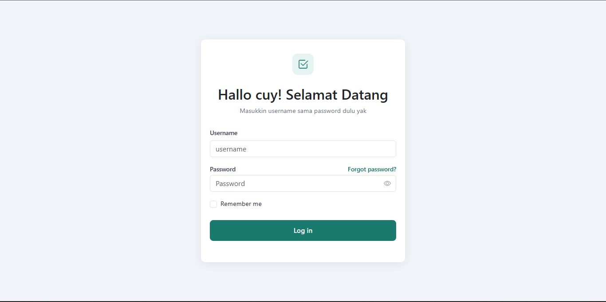
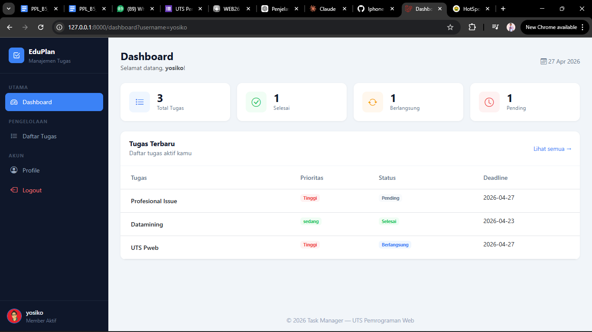
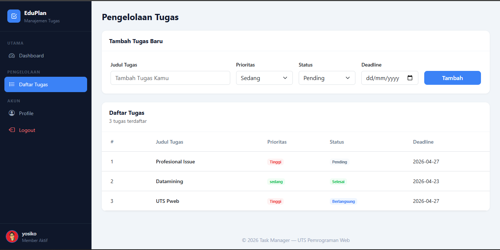
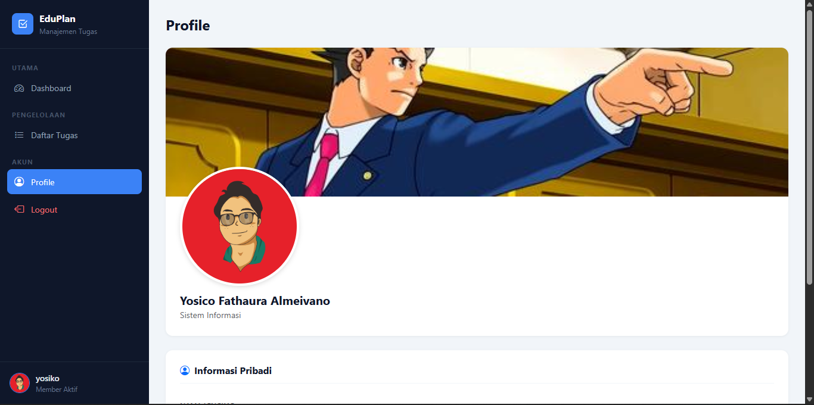

# Web EduPlan

Website ini merupakan **Web Pengelolaan tugas bagi mahasiswa**. Pengerjaan menggunakan **Laravel versi 11**. Website ini  juga support responsive terhadap tampilan mobile.

# Screebshot






# Font
### Sogue UI
```css
body { margin: 0; background: #f1f5f9; font-family: 'Segoe UI', sans-serif; }
```

# Spesifikasi

* **PHP 8.x** — Backend Language
* **Laravel 11** — PHP Framework (MVC Architecture)
* **Blade Template Engine** — Laravel Templating System
* **HTML5** — Struktur Halaman
* **CSS3** — Custom Styling
* **Bootstrap 5.3 (CDN)** — CSS Framework
* **Bootstrap Icons 1.11 (CDN)** — Icon Library
* **JavaScript (Vanilla DOM)** — Interaksi Frontend
* **Segoe UI** — Font Utama 

# Struktur folder

```
project-root/
├── app/
│   ├── Http/
│   │   └── Controllers/
│   │       ├── Controller.php
│   │       └── PageController.php
├── public/
│   ├── images/
│
├── resources/
│   └── views/
│       ├── components/
│       │   ├── footer.blade.php
│       │   └── navbar.blade.php
│       │
│       ├── layouts/
│       │   └── app.blade.php
│       │
│       ├── dashboard.blade.php
│       ├── login.blade.php
│       ├── pengelolaan.blade.php
│       └── profile.blade.php
│
├── routes/
│   ├── console.php
│   └── web.php
```

# Tujuan

Project ini dibuat untuk:

* Memenuhi tugas UTS Pemrograman Web Genap 2025/2026
* Memahami arsitektur MVC menggunakan Laravel
* Mengimplementasikan Blade Template Engine
* Memahami alur Request-Response di Laravel
* Mengirimkan data antar halaman menggunakan Request Parameter
* Membuat tampilan web yang responsif dan modern